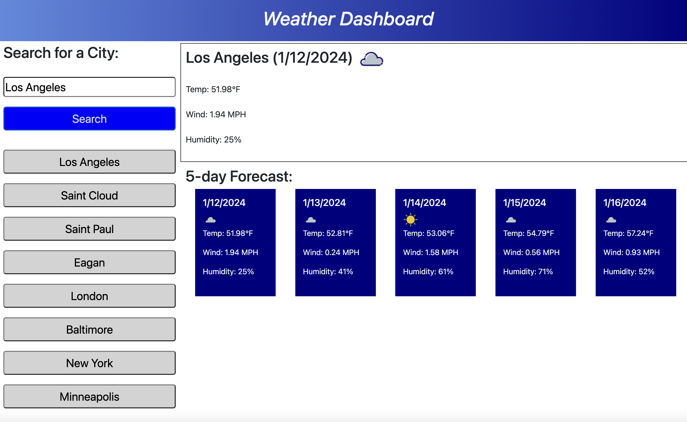

https://www.iconfinder.com/weather-icons?price=free source of the icons
# Weather Dashboard

## Description

This project was created to create a web page capable of searching for cities around the world and displaying the current day forecast and a five day forecast.

## Installation

Installation is not required. The webpage is accessible from any web browser application.

## Usage

To use this service simply navigate to the website address below.

https://ahelmin.github.io/Weather-Dashboard/

To use the Weather Dashboard, type the name of the city in the search box and click the 'Search' button. The most recent eight cities that you have searched for will be listed as buttons on the left side of the screen. Just click these buttons to have the weather for these cities displayed again. 

## Credits

Thanks goes to the University of Minnesota and Edx Bootcamp for providing the assistance needed to complete this project. A thanks goes out to Iconfinder (https://www.iconfinder.com/weather-icons?price=free) for the icons used in this application.

## License

MIT License

Copyright (c) 2023 helm0127

Permission is hereby granted, free of charge, to any person obtaining a copy
of this software and associated documentation files (the "Software"), to deal
in the Software without restriction, including without limitation the rights
to use, copy, modify, merge, publish, distribute, sublicense, and/or sell
copies of the Software, and to permit persons to whom the Software is
furnished to do so, subject to the following conditions:

The above copyright notice and this permission notice shall be included in all
copies or substantial portions of the Software.

THE SOFTWARE IS PROVIDED "AS IS", WITHOUT WARRANTY OF ANY KIND, EXPRESS OR
IMPLIED, INCLUDING BUT NOT LIMITED TO THE WARRANTIES OF MERCHANTABILITY,
FITNESS FOR A PARTICULAR PURPOSE AND NONINFRINGEMENT. IN NO EVENT SHALL THE
AUTHORS OR COPYRIGHT HOLDERS BE LIABLE FOR ANY CLAIM, DAMAGES OR OTHER
LIABILITY, WHETHER IN AN ACTION OF CONTRACT, TORT OR OTHERWISE, ARISING FROM,
OUT OF OR IN CONNECTION WITH THE SOFTWARE OR THE USE OR OTHER DEALINGS IN THE
SOFTWARE.
